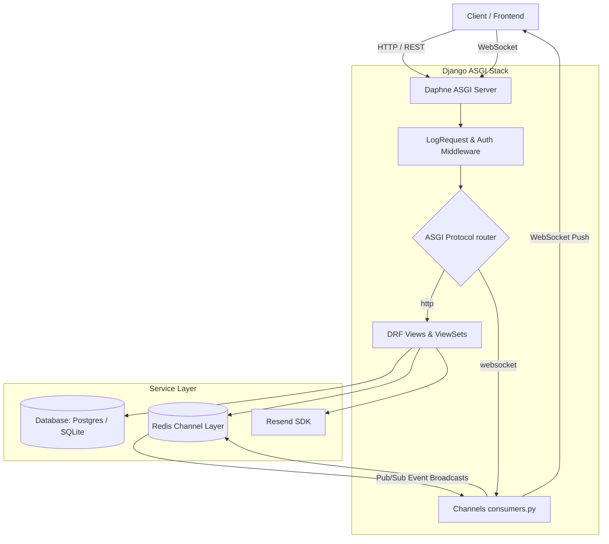

# fplaces - Architectural Flow Document

This document describes the high-level architecture, deployment layout, request-response routing path, and file structures of the fplaces application.

---

## 1. System Components Architecture

fplaces uses an asynchronous server architecture to handle both REST HTTP endpoints and long-lived WebSocket connections concurrently.



---

## 2. Request-Response Lifecycles

### 2.1 HTTP Request Lifecycle (REST)

1. **Client Request**: Client sends an HTTP request (e.g. `POST /api/forum/posts/` with a JWT header).
2. **Server (Daphne)**: Daphne receives the request and wraps it in a WSGI/ASGI request object.
3. **Middleware**:
   - `SecurityMiddleware`, `SessionMiddleware`, `CsrfViewMiddleware` run.
   - `JWTAuthentication` parses the token and attaches the authenticated user.
   - `LogRequest` logs details of the incoming request.
   - `UpdateLastLoginMiddleware` updates the user's `last_login` timestamp in the background.
4. **URL Routing**: `config/urls.py` routes the request to the matching ViewSet (`PostViewSet.create`).
5. **Serialization & Business Logic**:
   - `PostSerializer` validates fields (venue, section, content length).
   - `perform_create` saves the post, calls the `broadcast()` function to publish a `new_post` event, and evaluates section heat updates.
6. **Database Persistence**: The transaction is committed to the database.
7. **Response**: A JSON response is serialized and returned to Daphne, which sends it back to the client.

### 2.2 WebSocket Lifecycle (Real-Time Broadcasts)

1. **Connection**: Client requests a WebSocket connection to `ws/venues/<venue_id>/?token=<access_token>`.
2. **Authentication**: `core/middleware.py` intercepts the connection, extracts the token from the query parameters, verifies it, and attaches the user to the connection scope. If invalid/anonymous, the connection is closed.
3. **Channel Group Joining**: The `VenueConsumer` joins the matching venue channel group (e.g., `venue_<venue_id>`).
4. **Listening**: Connection remains open, waiting for incoming messages or server-side broadcasts.
5. **Broadcast Trigger**: When a post viewset triggers `broadcast(group_name, event_type, payload)`, ASGI sends the event to the Redis Channel Layer.
6. **Pub/Sub Forwarding**: Redis pushes the message to all connected Daphne worker threads listening to `venue_<venue_id>`.
7. **Client Delivery**: `BroadcastConsumer.broadcast_message` formats the payload and sends it over the active WebSocket frames to the client.

---

## 3. Backend Codebase Directory Map

```text
fplaces/
├── manage.py                   # Django CLI administration entry point
├── config/                     # Core project settings and configurations
│   ├── settings.py             # Database, apps, middlewares, simpleJWT, and Resend settings
│   ├── urls.py                 # Master REST API routing
│   ├── admin_urls.py           # Unified routing for administrative endpoints
│   ├── routing.py              # WebSocket routing definition
│   └── asgi.py / wsgi.py       # ASGI/WSGI entry files for deployment
│
├── templates/                  # Project-level HTML templates
│   └── admin/
│       └── index.html          # Overridden Django admin index displaying API doc panel
│
├── core/                       # Shared utility structures
│   ├── models.py               # Abstract BaseModel with soft-delete
│   ├── managers.py             # Custom BaseManager to filter active/archived items
│   ├── middleware.py           # JWT WebSocket auth & logging middleware
│   ├── realtime.py             # Redis channel group names and broadcast helper
│   ├── consumers.py            # Generic WebSocket Broadcaster
│   └── exceptions.py           # Standard DRF Exception handler overrides
│
├── users/                      # User authentication, OTPs, and profiles
│   ├── models/
│   │   ├── user.py             # Custom User model
│   │   └── otp.py              # Email OTP verification model
│   ├── serializers/
│   │   ├── auth.py             # Registration, Login, and OTP Validation
│   │   └── admin.py            # Admin-only user and metrics serializers
│   └── views/
│       ├── auth.py             # Auth endpoints implementation
│       └── admin.py            # Admin stats and user viewsets
│
├── forum/                      # Venue discussion board and feed components
│   ├── models/                 # Venue, Section, Category, Post, Comment, Vote, Flag
│   ├── serializers/            # Forum data validators and formats
│   │   └── admin.py            # Admin post detail serializer
│   ├── views/                  # Feed querying and upvote/flag toggle actions
│   │   └── admin.py            # Admin post moderation viewsets
│   └── consumers.py            # Venue-scoped websocket room consumer
│
└── notifications/              # In-app notifications & email delivery
    ├── models/                 # Notification model definitions
    ├── services/
    │   └── mail.py             # Resend SDK outbound email service
    └── templates/              # HTML Email template layouts (verify_email, password_reset)
```
