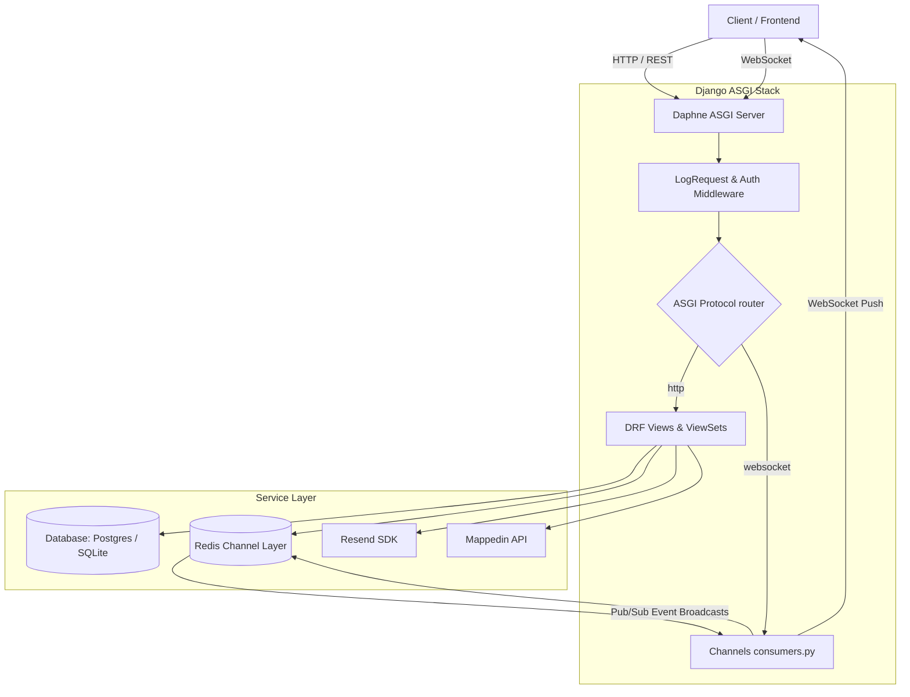

# fplaces - Architectural Flow Document

This document describes the high-level architecture, deployment layout, request-response routing path, and file structures of the fplaces application.

---

## 1. System Components Architecture

fplaces uses an asynchronous server architecture to handle both REST HTTP endpoints and long-lived WebSocket connections concurrently.


```mermaid
graph TD
    Client[Client / Frontend] -->|HTTP / REST| WebServer[Daphne ASGI Server]
    Client -->|WebSocket| WebServer

    subgraph Django ASGI Stack
        WebServer --> Middleware[LogRequest & Auth Middleware]
        Middleware --> Router{ASGI Protocol router}

        Router -->|http| WSGI[DRF Views & ViewSets]
        Router -->|websocket| ASGI[Channels consumers.py]
    end

    subgraph Service Layer
        WSGI --> DB[(Database: Postgres / SQLite)]
        WSGI --> Redis[(Redis Channel Layer)]
        ASGI --> Redis
        WSGI --> EmailService[Resend SDK]
        WSGI --> Mappedin[Mappedin API]
    end

    Redis -->|Pub/Sub Event Broadcasts| ASGI
    ASGI -->|WebSocket Push| Client
```

With no `REDIS_URL` configured (plain local dev), the channel layer falls back to an in-process, single-worker implementation instead of Redis — broadcasts still work, but only within one process.

---

## 2. Request-Response Lifecycles

### 2.1 HTTP Request Lifecycle (REST)

1. **Client Request**: Client sends an HTTP request (e.g. `POST /api/forum/posts/` with a JWT header).
2. **Server (Daphne)**: Daphne receives the request and wraps it in a WSGI/ASGI request object.
3. **Middleware**:
   - `SecurityMiddleware`, `SessionMiddleware`, `CsrfViewMiddleware` run.
   - `JWTAuthentication` parses the token and attaches the authenticated user. A guest token (no resolvable `user_id` claim) fails authentication here rather than resolving to a user.
   - `LogRequest` logs details of the incoming request.
   - `UpdateLastLoginMiddleware` updates the user's `last_login` timestamp in the background.
4. **URL Routing**: `config/urls.py` routes the request to the matching ViewSet (`PostViewSet.create`).
5. **Serialization & Business Logic**:
   - `PostSerializer` validates fields (venue, section, content length).
   - `perform_create` saves the post, calls the `broadcast()` function to publish a `new_post` event, and evaluates section heat updates.
6. **Database Persistence**: The transaction is committed to the database.
7. **Response**: A JSON response is serialized and returned to Daphne, which sends it back to the client.

### 2.2 WebSocket Lifecycle (Real-Time Broadcasts)

1. **Connection**: Client requests a WebSocket connection to a room, e.g. `ws/venues/<venue_id>/?token=<access_token>` (venue-wide feed) or `ws/venues/<venue_id>/locations/<location_id>/?token=<access_token>` (a single map-pin's chat).
2. **Authentication**: `users/middleware.py: JWTAuthMiddleware` intercepts the connection, extracts the token from the query parameters, verifies it, and attaches the user to the connection scope. If invalid/anonymous, the connection is closed.
3. **Channel Group Joining**: The matching consumer joins its channel group — `VenueConsumer` joins `venue_<venue_id>`; `LocationConsumer` joins a group name derived by hashing `(venue_id, location_id)`, since `location_id` is an opaque, client-supplied string that may not fit the channel layer's allowed group-name characters/length.
4. **Listening**: Connection remains open, waiting for incoming messages or server-side broadcasts.
5. **Broadcast Trigger**: When a viewset triggers `broadcast(group_name, event_type, payload)` (or the location-specific `broadcast_location_message(...)`), ASGI sends the event to the Redis Channel Layer.
6. **Pub/Sub Forwarding**: Redis pushes the message to all connected Daphne worker threads listening to that group.
7. **Client Delivery**: The consumer formats the payload and sends it over the active WebSocket frames to the client — `BroadcastConsumer.broadcast_message` for the shared `{"event", "payload"}` envelope used by most rooms, or `LocationConsumer.location_message` for the location room's `{"type": "new_location_message", "message": {...}}` shape.

---

## 3. Backend Codebase Directory Map

```text
fplaces/
├── manage.py                   # Django CLI administration entry point
├── config/                     # Core project settings and configurations
│   ├── settings.py             # Database, apps, middlewares, simpleJWT, drf-spectacular, and Resend settings
│   ├── urls.py                 # Master REST API routing
│   ├── admin_urls.py           # Unified routing for administrative endpoints
│   ├── routing.py              # Aggregates per-app WebSocket routing
│   └── asgi.py / wsgi.py       # ASGI/WSGI entry files for deployment
│
├── doc/                         # Architecture, requirements, and flow documentation
│   └── frontend_integration_guide.html  # REST + WebSocket contract reference, served at /api/guide.html
│
├── templates/                  # Project-level HTML templates
│   └── admin/
│       └── index.html          # Overridden Django admin index displaying API doc panel
│
├── core/                       # Shared utility structures
│   ├── models.py               # Abstract BaseModel with soft-delete
│   ├── managers.py             # Custom BaseManager to filter active/archived items
│   ├── middleware.py           # HTTP logging & last-login middleware
│   ├── realtime.py             # Channel group name helpers (incl. opaque-id hashing) and broadcast wrappers
│   ├── consumers.py            # Generic WebSocket Broadcaster base class
│   ├── viewsets.py             # BaseViewSet: soft-delete-aware ModelViewSet with a generic restore action
│   └── exceptions.py           # Standard DRF Exception handler overrides
│
├── users/                      # User authentication, guest access, OTPs, and profiles
│   ├── models/
│   │   ├── user.py             # Custom User model
│   │   ├── otp.py              # Email OTP verification model
│   │   └── guest_session.py    # Per-device guest trial tracking
│   ├── middleware.py            # JWT WebSocket auth middleware (used by config/asgi.py)
│   ├── serializers/
│   │   ├── auth.py             # Registration, Login, Google login, and OTP validation
│   │   ├── profile.py          # Own-profile serializer (interests, stat, recent_posts) and public author serializer
│   │   ├── guest.py            # Guest access request/response shapes
│   │   └── admin.py            # Admin-only user and metrics serializers
│   └── views/
│       ├── auth.py             # Auth endpoints implementation
│       ├── guest.py            # Guest JWT issuance and preference updates
│       ├── profile.py          # MeView / ChangePasswordView
│       └── admin.py            # Admin stats and user viewsets
│
├── forum/                      # Venue discussion board, map-pin chat, and feed components
│   ├── models/                 # Venue, Section, Category, Interest, Post, Comment, Vote, Flag, LocationConversation, LocationMessage
│   ├── serializers/            # Forum data validators and formats
│   │   └── admin.py            # Admin post detail serializer
│   ├── filters/                # django-filter FilterSets, one per listable resource
│   ├── views/                  # Feed querying, upvote/flag toggle, and location-conversation find-or-create actions
│   │   └── admin.py            # Admin post moderation viewsets
│   ├── consumers.py             # VenueConsumer (feed/heatmap room) and LocationConsumer (per map-pin chat room)
│   └── routing.py               # ws/venues/<id>/ and ws/venues/<id>/locations/<location_id>/ patterns
│
├── notifications/               # In-app notifications & email delivery
│   ├── models/                 # Notification model definitions
│   ├── services/
│   │   ├── notify.py           # Creates + live-pushes a Notification
│   │   └── mail.py             # Resend SDK outbound email service
│   ├── views/admin.py           # AdminNotificationViewSet: targeted email/push broadcasts
│   └── templates/              # HTML Email template layouts (verify_email, password_reset, admin_notification)
│
├── map/                         # Thin proxy around the Mappedin API
│   ├── services/mappedin.py     # Fetches a short-lived Mappedin access token
│   └── views.py                 # GET /api/maps/token/
│
└── payments/                    # Scaffolded app, no models/endpoints yet
```

---

## 4. Deployment Layout

- **Container**: A single Docker image (see `Dockerfile`) runs `run.sh`, which applies pending migrations (`manage.py migrate --noinput`) and then starts Daphne on port 8080, serving both REST and WebSocket traffic on one port.
- **Runtime**: AWS Fargate (ECS), with the image pushed to a dedicated ECR repository.
- **Infrastructure as Code**: `terraform/` provisions the ECR repo, ECS cluster/service/task definition, load balancer, and networking (default VPC).
- **CI/CD**: `.github/workflows/deploy.yml` builds and pushes the image to ECR on every push to `main`, then forces a new ECS deployment. Pre-commit checks run separately via `.github/workflows/pre-commit.yml`.
- **Configuration**: The ECS task definition's environment variables are populated from a local `.env` file at `terraform apply` time (not from CI) — infrastructure changes to environment values are applied manually via Terraform, not through the deploy workflow.
- **Database**: PostgreSQL in staging/production (currently Supabase-hosted, per `DB_HOST`/`DB_PORT` settings); SQLite for local development with no `DATABASE_URL`/`DB_HOST` set. Running under pytest always overrides to SQLite regardless of those settings (`config/settings.py` checks `"pytest" in sys.modules`), so the test suite never touches the shared Postgres instance — it gets Django's default in-memory SQLite test database instead, which also sidesteps `CREATE`/`DROP DATABASE` contention against a pooled connection.
- **Realtime fan-out**: Redis (`REDIS_URL`) backs the Channels layer in any multi-worker deployment; without it, broadcasts are process-local only, which is only appropriate for local development.
