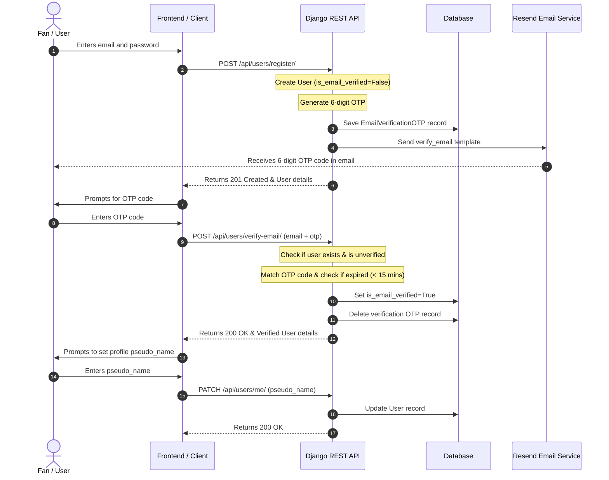
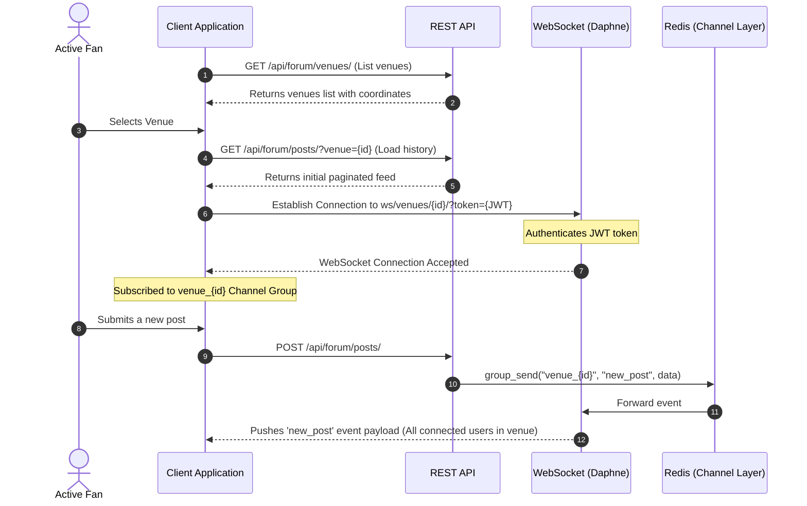
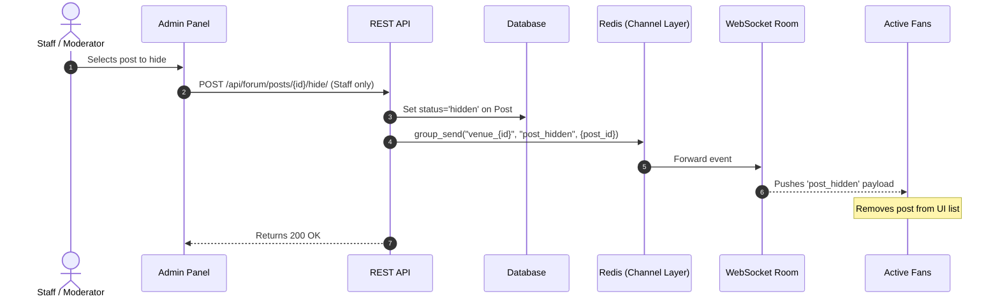

# fplaces - Implementation & User Flow Document

This document outlines the workflows and sequences of interactions between users, the REST API, the WebSocket server, and backend services.

---

## 1. Onboarding and Verification Flow

The onboarding flow ensures that users verify their email addresses via a One-Time Password (OTP) before they are allowed to complete their profile setup and fully interact on the platform.

---

## 2. Real-Time Venue Discussion Feed Flow

Once onboarding is completed, users join a venue room to receive live posts, comments, upvote updates, and heatmaps.

---

## 3. Post Interaction Flow (Upvoting & Flagging)

### 3.1 Upvoting (Idempotent Toggle)

- User requests to upvote a post.
- If a `PostVote` record for `(post, user)` does not exist:
  - Create it.
  - Increment the post's `upvotes_count` by 1.
  - Broadcast an `upvote_update` event (`upvoted=True`) to the venue's WebSocket group.
- If the `PostVote` record already exists and is active:
  - Soft-archive it (`is_archived=True`).
  - Decrement the post's `upvotes_count` by 1.
  - Broadcast an `upvote_update` event (`upvoted=False`) to the WebSocket group.
- If the `PostVote` record exists but is soft-archived:
  - Restore it (`is_archived=False`).
  - Increment the post's `upvotes_count` by 1.
  - Broadcast an `upvote_update` event (`upvoted=True`).

### 3.2 Flagging (Moderation Request)

- User flags a post for moderation with a `reason`.
- Database atomically creates or restores the `PostFlag` record for `(post, user)`.
- If new or restored, the post's `flags_count` is incremented.
- Flags are moderator-facing only; no WebSocket event is broadcast to the public feed.

---

## 4. Moderation & Post Hiding Flow

---

## 5. In-App Notifications Flow

Notifications are created synchronously and dispatched immediately over the user's personal WebSocket.

1. **Trigger Action**: User A comments on User B's post.
2. **Persistence**:
   - Check if User A (actor) is not User B (recipient).
   - Create a `Notification` record in the database (`recipient=User B`, `actor=User A`, `verb='comment'`).
3. **Real-time Push**:
   - Call `broadcast("user_UserB_id", "new_notification", notification_data)`.
   - Connected WebSockets of User B receive the payload and increment their unread notification badge count in real-time.

---

## 6. Admin Control Flows

Dedicated administrative actions permit complete dashboard customization and system moderation.

### 6.1 Admin Stats Check

- Admin opens Dashboard -> Client hits `GET /api/admin/stats/`.
- Backend aggregates metrics across Users, Posts, Comments, and active Venues, querying specific post counts per category and venue.
- Returns dashboard statistics package to Admin.

### 6.2 Flagged Content Moderation

- Admin retrieves the moderation queue via `GET /api/admin/posts/flagged/` (sorted by flag count descending).
- Admin reviews a flagged post and clicks **Clear Flags**.
- Client calls `POST /api/admin/posts/{id}/clear-flags/`.
- Backend resets `flags_count` to `0` and soft-archives all related `PostFlag` records.
