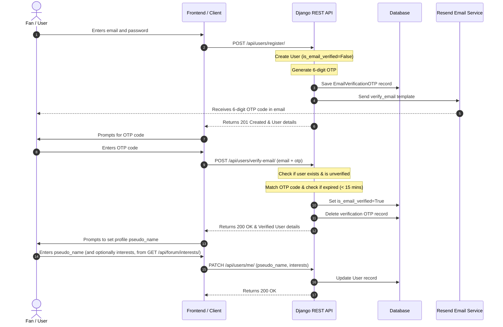
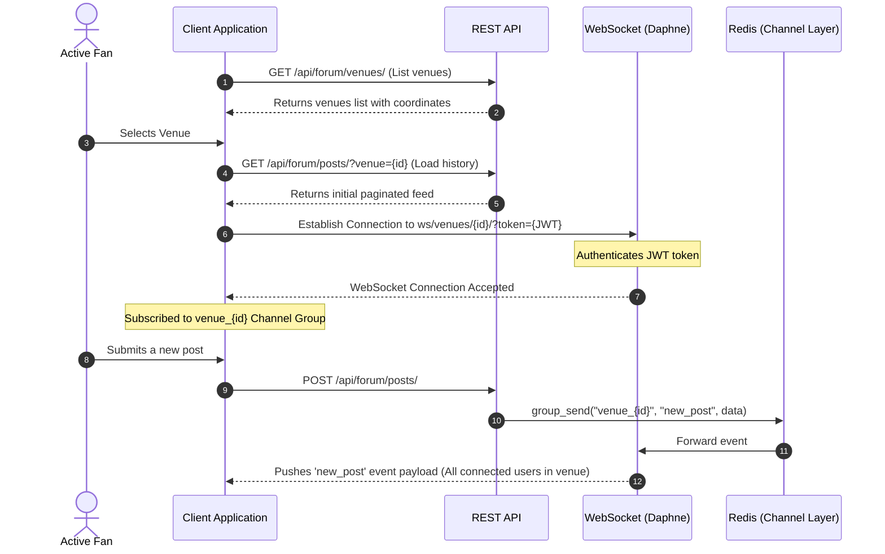
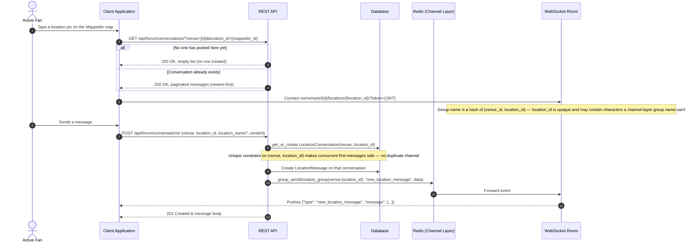
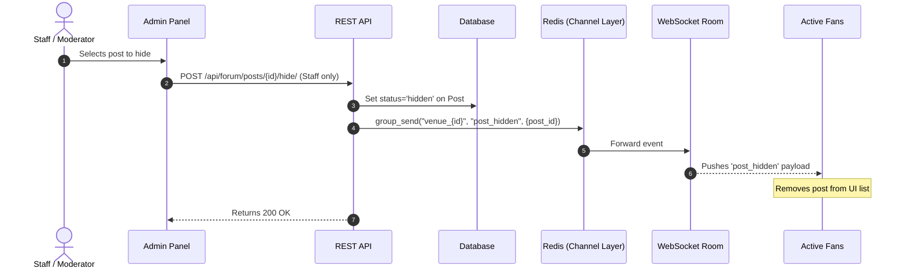

# fplaces - Implementation & User Flow Document

This document outlines the workflows and sequences of interactions between users, the REST API, the WebSocket server, and backend services.

---

## 1. Onboarding and Verification Flow

The onboarding flow ensures that users verify their email addresses via a One-Time Password (OTP) before they are allowed to complete their profile setup and fully interact on the platform.

```mermaid
sequenceDiagram
    autonumber
    actor User as Fan / User
    participant Client as Frontend / Client
    participant API as Django REST API
    participant DB as Database
    participant EmailService as Resend Email Service

    User->>Client: Enters email and password
    Client->>API: POST /api/users/register/
    Note over API: Create User (is_email_verified=False)
    Note over API: Generate 6-digit OTP
    API->>DB: Save EmailVerificationOTP record
    API->>EmailService: Send verify_email template
    EmailService-->>User: Receives 6-digit OTP code in email
    API-->>Client: Returns 201 Created & User details
    Client->>User: Prompts for OTP code
    User->>Client: Enters OTP code
    Client->>API: POST /api/users/verify-email/ (email + otp)
    Note over API: Check if user exists & is unverified
    Note over API: Match OTP code & check if expired (< 15 mins)
    API->>DB: Set is_email_verified=True
    API->>DB: Delete verification OTP record
    API-->>Client: Returns 200 OK & Verified User details
    Client->>User: Prompts to set profile pseudo_name
    User->>Client: Enters pseudo_name (and optionally interests, from GET /api/forum/interests/)
    Client->>API: PATCH /api/users/me/ (pseudo_name, interests)
    API->>DB: Update User record
    API-->>Client: Returns 200 OK
```

Alternatively, a user can skip password-based registration entirely via `POST /api/users/login/google/` (Google OAuth `id_token`), which auto-creates and auto-verifies the account on first use, or start as a guest (see Section 2) and register later.

---

## 2. Guest Access Flow

Lets a visitor try the app — including viewing the venue map — without creating an account.

- Client calls `POST /api/users/guest/` with `ip_address` and `device_fingerprint`.
- Backend gets-or-creates a `GuestSession` keyed by `device_fingerprint` and checks `is_trial_active` (valid through the calendar day of first use).
  - If the trial has already expired for this device: return `403`, prompting the client to fall back to full registration.
- On success, backend issues a short-lived JWT (`token_type=guest`, `sub=guest:<device_fingerprint>`, no resolvable `user_id`) and fetches a Mappedin token in the same round-trip.
- Client uses the guest JWT as `Authorization: Bearer <token>` on guest-permitted endpoints (map rendering, browsing feeds) — every endpoint that requires a full account (posting, chatting, profile) rejects it, since standard `JWTAuthentication` can't resolve a `user_id` claim from it.
- Client can call `PATCH /api/users/guest/update/` (with the guest JWT) to flag `has_tried_ar_view` / `has_tried_2d_view` as the guest explores.
- When the guest decides to commit, they register or log in normally (Section 1); the guest session/JWT is simply discarded client-side — there's no merge step.

---

## 3. Real-Time Venue Discussion Feed Flow

Once onboarding is completed, users join a venue room to receive live posts, comments, upvote updates, and heatmaps.

```mermaid
sequenceDiagram
    autonumber
    actor User as Active Fan
    participant Client as Client Application
    participant API as REST API
    participant WS as WebSocket (Daphne)
    participant Redis as Redis (Channel Layer)

    Client->>API: GET /api/forum/venues/ (List venues)
    API-->>Client: Returns venues list with coordinates
    User->>Client: Selects Venue
    Client->>API: GET /api/forum/posts/?venue={id} (Load history)
    API-->>Client: Returns initial paginated feed
    Client->>WS: Establish Connection to ws/venues/{id}/?token={JWT}
    Note over WS: Authenticates JWT token
    WS-->>Client: WebSocket Connection Accepted
    Note over Client: Subscribed to venue_{id} Channel Group

    User->>Client: Submits a new post
    Client->>API: POST /api/forum/posts/
    API->>Redis: group_send("venue_{id}", "new_post", data)
    Redis->>WS: Forward event
    WS-->>Client: Pushes 'new_post' event payload (All connected users in venue)
```

The same `venue_{id}` room also carries `new_comment` (Section 5), `upvote_update` and `post_hidden` (Section 4), and `section_heat_update` events — one socket per venue covers the whole shared feed.

---

## 4. Post Interaction Flow (Upvoting & Flagging)

### 4.1 Upvoting (Idempotent Toggle)

- User requests to upvote a post.
- If a `PostVote` record for `(post, user)` does not exist:
  - Create it.
  - Increment the post's `upvotes_count` by 1.
  - Broadcast an `upvote_update` event (`upvoted=True`) to the venue's WebSocket group.
- If the `PostVote` record already exists and is active:
  - Soft-archive it (`is_archived=True`).
  - Decrement the post's `upvotes_count` by 1.
  - Broadcast an `upvote_update` event (`upvoted=False`) to the WebSocket group.
- If the `PostVote` record exists but is soft-archived:
  - Restore it (`is_archived=False`).
  - Increment the post's `upvotes_count` by 1.
  - Broadcast an `upvote_update` event (`upvoted=True`).

### 4.2 Flagging (Moderation Request)

- User flags a post for moderation with a `reason`.
- Database atomically creates or restores the `PostFlag` record for `(post, user)`.
- If new or restored, the post's `flags_count` is incremented.
- Flags are moderator-facing only; no WebSocket event is broadcast to the public feed.

---

## 5. Comments Flow

- User submits a comment on a post: `POST /api/forum/comments/` with `post` and `content`.
- Backend creates the `Comment` row, attributed to the authenticated user.
- Backend broadcasts a `new_comment` event to the post's venue room (`venue_{venue_id}`) — comments do **not** get a dedicated socket; they ride the same room as the live feed.
- Backend creates a `comment`-verb `Notification` for the post's author (skipped if the commenter is the post's own author), pushed live over that author's personal notification socket (Section 8).
- Only the comment's own author or staff may later edit (`PATCH`) or soft-delete (`DELETE`) it.

---

## 6. Location (Map-Pin) Conversation Flow

Chat around a specific point on the venue map — identified by `(venue, location_id)`, where `location_id` is an opaque Mappedin location/place id, not an admin `Section`. The channel is created lazily; the client never generates or passes a conversation id.

```mermaid
sequenceDiagram
    autonumber
    actor User as Active Fan
    participant Client as Client Application
    participant API as REST API
    participant DB as Database
    participant Redis as Redis (Channel Layer)
    participant WS as WebSocket Room

    User->>Client: Taps a location pin on the Mappedin map
    Client->>API: GET /api/forum/conversations/?venue={id}&location_id={mappedin_id}
    alt No one has posted here yet
        API-->>Client: 200 OK, empty list (no row created)
    else Conversation already exists
        API-->>Client: 200 OK, paginated messages (newest first)
    end
    Client->>WS: Connect ws/venues/{id}/locations/{location_id}/?token={JWT}
    Note over WS: Group name is a hash of (venue_id, location_id) — location_id is opaque and may contain characters a channel-layer group name can't
    User->>Client: Sends a message
    Client->>API: POST /api/forum/conversations/ (venue, location_id, location_name?, content)
    API->>DB: get_or_create LocationConversation(venue, location_id)
    Note over API,DB: Unique constraint on (venue, location_id) makes concurrent first-messages safe — no duplicate channel
    API->>DB: Create LocationMessage on that conversation
    API->>Redis: group_send(location_group(venue,location_id), "new_location_message", data)
    Redis->>WS: Forward event
    WS-->>Client: Pushes {"type": "new_location_message", "message": {...}}
    API-->>Client: 201 Created & message body
```

Only the message's own author or staff may later edit or soft-delete it. Admin `Section`s are never created from map pins — they remain a separate, small, hand-curated catalog used for onboarding and the heatmap.

---

## 7. Moderation & Post Hiding Flow

```mermaid
sequenceDiagram
    autonumber
    actor Admin as Staff / Moderator
    participant Client as Admin Panel
    participant API as REST API
    participant DB as Database
    participant Redis as Redis (Channel Layer)
    participant WS as WebSocket Room
    participant Fan as Active Fans

    Admin->>Client: Selects post to hide
    Client->>API: POST /api/forum/posts/{id}/hide/ (Staff only)
    API->>DB: Set status='hidden' on Post
    API->>Redis: group_send("venue_{id}", "post_hidden", {post_id})
    Redis->>WS: Forward event
    WS-->>Fan: Pushes 'post_hidden' payload
    Note over Fan: Removes post from UI list
    API-->>Client: Returns 200 OK
```

---

## 8. In-App Notifications Flow

Notifications are created synchronously and dispatched immediately over the user's personal WebSocket.

1. **Trigger Action**: User A comments on User B's post (or upvotes it, or staff moderates it, or an admin sends a broadcast — Section 9.3).
2. **Persistence**:
   - Check if the actor is not the recipient (skip self-notifications where applicable).
   - Create a `Notification` record in the database (`recipient`, `actor`, `verb` — one of `comment`, `upvote`, `moderation`, `broadcast`).
3. **Real-time Push**:
   - Call `broadcast("user_<recipient_id>", "new_notification", notification_data)`.
   - Connected WebSockets of the recipient receive the payload and increment their unread notification badge count in real-time.
4. **Catch-up**: `GET /api/notifications/` (history), `GET /api/notifications/unread_count/` (badge count without paginating), `POST /api/notifications/<id>/mark_read/`, `POST /api/notifications/mark_all_read/`.

---

## 9. Admin Control Flows

Dedicated administrative actions permit complete dashboard customization and system moderation.

### 9.1 Admin Stats Check

- Admin opens Dashboard -> Client hits `GET /api/admin/stats/`.
- Backend aggregates metrics across Users, Posts, Comments, and active Venues, querying specific post counts per category and venue.
- Returns dashboard statistics package to Admin.

### 9.2 Flagged Content Moderation

- Admin retrieves the moderation queue via `GET /api/admin/posts/flagged/` (sorted by flag count descending).
- Admin reviews a flagged post and clicks **Clear Flags**.
- Client calls `POST /api/admin/posts/{id}/clear-flags/`.
- Backend resets `flags_count` to `0` and soft-archives all related `PostFlag` records.

### 9.3 Admin Broadcast Notification

- Admin composes a `subject`/`message` and picks a target: any combination of `venue`, `section`, `category`, or explicit `users` ids (matched users are the union of whichever filters are given), plus which `channels` to use (`email`, `push`, or both).
- Client calls `POST /api/admin/notifications/`.
- Backend resolves the matching active users, then per user/channel: sends the templated email via Resend and/or creates a `broadcast`-verb `Notification` pushed live over `ws/notifications/`.
- A failure sending to one user/channel (e.g. a bad email address) is swallowed and doesn't stop the rest of the broadcast.
- Backend returns `users_targeted`, `email_sent`, and `push_sent` counts so the admin panel can report delivery success.
